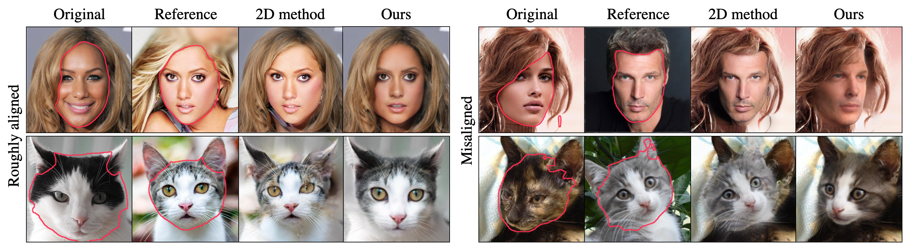
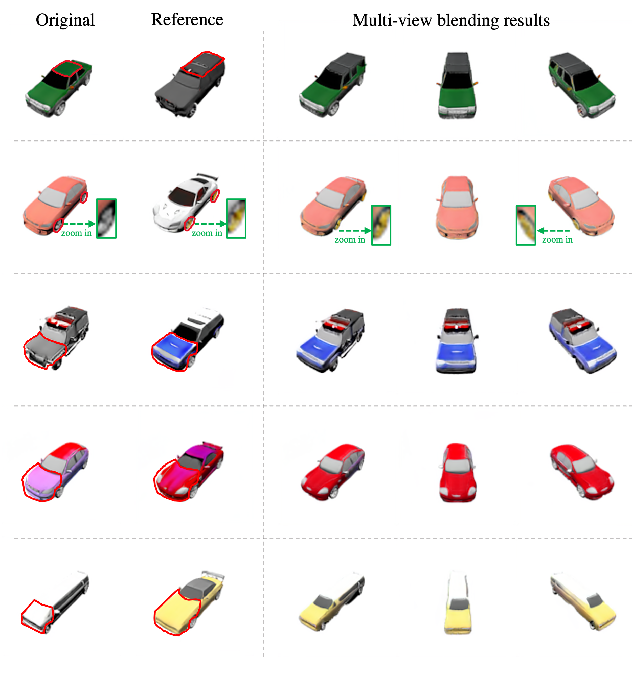

## BlendNeRF - Official PyTorch Implementation

> **3D-aware Blending with Generative NeRFs** 
> [Hyunsu Kim](https://blandocs.github.io)1, [Gayoung Lee](https://sites.google.com/site/gylee1103)1, [Yunjey Choi](https://yunjey.github.io)1, [Jin-Hwa Kim](http://wityworks.com)1,2, [Jun-Yan Zhu](https://www.cs.cmu.edu/~junyanz)3 
1NAVER AI Lab, 2SNU AIIS, 3CMU

[**Project page**](https://blandocs.github.io/blendnerf) | [**Arxiv**](https://arxiv.org/abs/2302.06608)

> **Abstract:** *Image blending aims to combine multiple images seamlessly. It remains challenging for existing 2D-based methods, especially when input images are misaligned due to differences in 3D camera poses and object shapes. To tackle these issues, we propose a 3D-aware blending method using generative Neural Radiance Fields (NeRF), including two key components: 3D-aware alignment and 3D-aware blending. For 3D-aware alignment, we first estimate the camera pose of the reference image with respect to generative NeRFs and then perform 3D local alignment for each part. To further leverage 3D information of the generative NeRF, we propose 3D-aware blending that directly blends images on the NeRF's latent representation space, rather than raw pixel space. Collectively, our method outperforms existing 2D baselines, as validated by extensive quantitative and qualitative evaluations with FFHQ and AFHQ-Cat.*

Code will come soon!

## Multi-view blending results

### CelebA-HQ (EG3D / FFHQ-pretrained)

### AFHQv2-Cat (EG3D)

### ShapeNet-Car (EG3D)

### FFHQ (StyleSDF)

## Comparison with baselines

### CelebA-HQ

### AFHQv2-Cat

