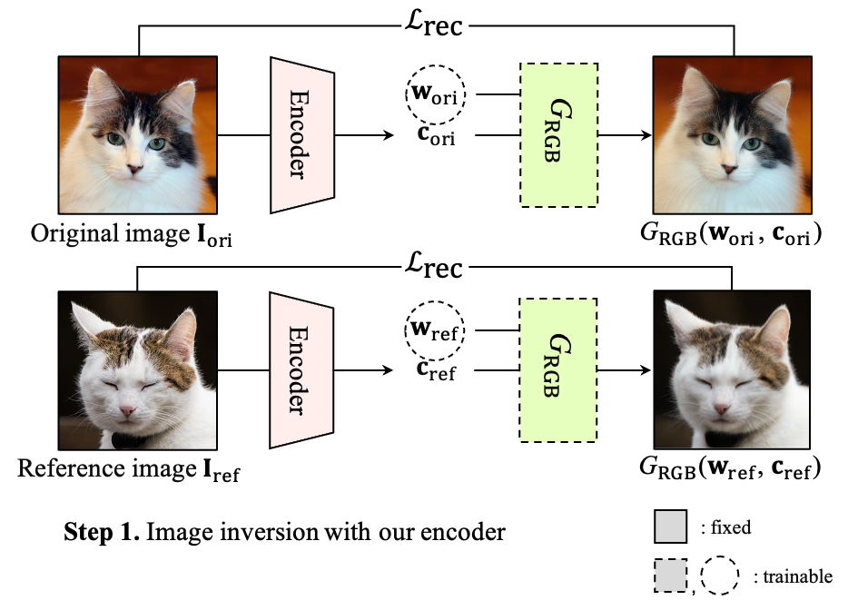
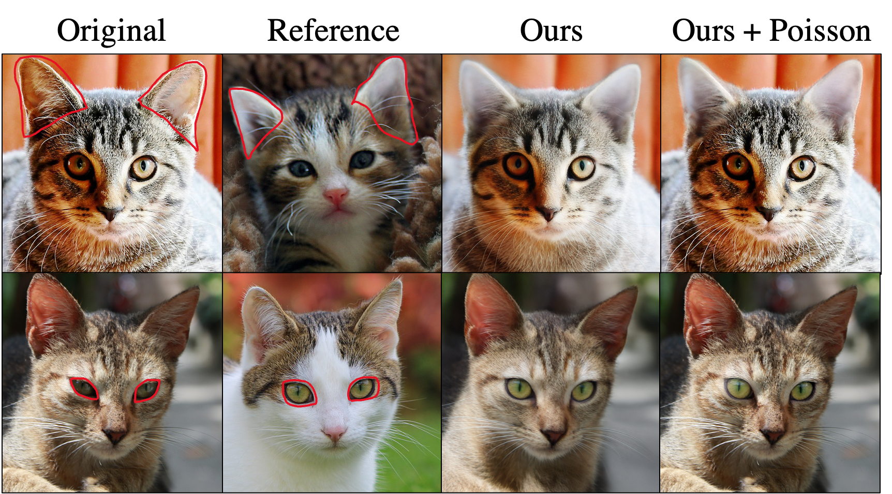

## [ICCV 23] BlendNeRF - Official PyTorch Implementation

<p align="middle"></p>

> **3D-aware Blending with Generative NeRFs**<br>
> [Hyunsu Kim](https://blandocs.github.io)<sup>1</sup>, [Gayoung Lee](https://sites.google.com/site/gylee1103)<sup>1</sup>, [Yunjey Choi](https://yunjey.github.io)<sup>1</sup>, [Jin-Hwa Kim](http://wityworks.com)<sup>1,2</sup>, [Jun-Yan Zhu](https://www.cs.cmu.edu/~junyanz)<sup>3</sup><br>
<sup>1</sup>NAVER AI Lab, <sup>2</sup>SNU AIIS, <sup>3</sup>CMU


[**Project**](https://blandocs.github.io/blendnerf) | [**arXiv**](https://arxiv.org/abs/2302.06608) | [**Paper**](https://blandocs.github.io/assets/publications/2023_BlendNeRF/paper.pdf)

Abstract: Image blending aims to combine multiple images seamlessly. It remains challenging for existing 2D-based methods, especially when input images are misaligned due to differences in 3D camera poses and object shapes. To tackle these issues, we propose a 3D-aware blending method using generative Neural Radiance Fields (NeRF), including two key components: <b>3D-aware alignment</b> and <b>3D-aware blending</b>. 

For 3D-aware alignment, we first estimate the camera pose of the reference image with respect to generative NeRFs and then perform pose alignment for objects. To further leverage 3D information of the generative NeRF, we propose 3D-aware blending that utilizes volume density and blends on the NeRF's latent space, rather than raw pixel space. 

## Installation

    

For all the experiments, we use a single A100 GPU.

#### Clone this repository:

```bash
git clone https://github.com/naver-ai/BlendNeRF.git
cd BlendNeRF/eg3d
```

#### Install the dependencies:
```bash
conda env create -f environment.yml
conda activate blendnerf
./install.sh
```

#### Download pretrained networks
```bash
./download.sh
```
Pretrained EG3D generators:
- `original_ffhq_512-128_400kimg.pkl` for FFHQ. As EG3D uses a different crop version of FFHQ compared to the original FFHQ, we fine-tune the EG3D using [the original crop version of FFHQ](https://github.com/NVlabs/ffhq-dataset).

- `afhqcats512-128.pkl` for AFHQv2-Cat.

Camera pose estimators (encoders):
- `encoder_ffhq.pkl` for FFHQ.
- `encoder_afhq.pkl` for AFHQv2-Cat.

Semantic segmentation networks. We create target masks for editing to automatically simulate user mask inputs using the networks:
- `bisenet.ckpt` for human faces. 
- `deeplab_epoch_19.pth` for cat faces.

## Blend images


Command examples in AFHQ dataset.

#### Step 1. Image inversion

<p align="middle"></p>

```bash
# For a single image, the first stage (W optimization) takes 23.6s, and the second stage (G optimization) takes 20.4s on a single A100 GPU.

python inversion.py --outdir=results/inversion --network=checkpoints/afhqcats512-128.pkl --encoder_network checkpoints/encoder_afhq.pkl --original_img_path test_images/afhq/original.png --reference_img_path test_images/afhq/reference.png
```

#### Step 2. Blend images with 3D-aware alignment
<p align="middle"></p>

- Ours only 
```bash
# It takes 27 seconds
python blend.py --outdir=results/editing/face --network=checkpoints/afhqcats512-128.pkl --editing_target face --inversion_path=results/inversion --enable_warping True --poisson=False --shapes=True --n_iterations=200 --ref_color_lambda 5 
```

- Ours + Poisson blending
```bash
# It takes 12 seconds
python blend.py --outdir=results/editing/face --network=checkpoints/afhqcats512-128.pkl --editing_target face --inversion_path=results/inversion --enable_warping True --poisson=True --shapes=False --n_iterations=100 --ref_color_lambda 5 
```

Argument instructions
```bash
--outdir: saving path
--network: pretrained generative NeRF path
--editing_target: blending region (e.g, face) # You can give your custom mask instead of using segmentation networks
--enable_warping: apply local alignment (Appendix C)
--poisson: apply Poisson blending with our method
--shapes: save meshes in .mrc format
--n_iterations: the number of iteration of optimization
--ref_color_lambda: the weight of the image blending loss # setting it zero means we only use the density blending loss
```


## Generate various results

### Diverse blending settings

Below command will generate blending results in various settings with `test_images/original.png` and `test_images/reference.png`.
```bash
python run.py

# Results are in 
- results/celeba_hq/inversion
- results/celeba_hq/editing
- results/afhq/inversion
- results/afhq/editing
```

<b>Datasets</b>:
* CelebA-HQ
* AFHQ

<b>Target parts</b>:
* CelebA-HQ (face, hair, nose, lip, eyes) 
* AFHQ (face, ears, eyes). 

Note that you can give any aribitray mask instead of using pretrained semantic segmentation networks.

<b>Methods</b>:
* Ours
* Ours + Poisson Blending

In our method without Poisson blending, multi-view blending and mesh results are included. Visualize the .mrc mesh file with [UCSF Chimerax](https://www.cgl.ucsf.edu/chimerax/).

### Diverse input images

Below command will generate multi-view blending results with diverse input images.
```bash
python run_more_images.py

# Results are in 
- results/celeba_hq/83_126
- results/celeba_hq/102_314
- ...
- results/afhq/2_325
- results/afhq/171_322
- ...
```

<p align="left"></p>

## Related Projects

The model code starts from [EG3D](https://github.com/NVlabs/eg3d). In addition, for the simple user interface, we automatically obtain mask inputs by utilizing the following projects:

- [BiseNet](https://github.com/CoinCheung/BiSeNet)
- [face-parsing.PyTorch](https://github.com/zllrunning/face-parsing.PyTorch)
- [DatasetGAN](https://github.com/nv-tlabs/datasetGAN_release)
- [Deeplabv3](https://arxiv.org/abs/1706.05587)

However, users are not limited to these options and can use their own custom masks if desired.

## Future Works

### Inversion
Currently, we use [PTI](https://github.com/danielroich/PTI) for our inversion method. However, we recognize that the inversion process is the bottleneck of our blending pipeline in terms of speed and quality. PTI is slow and sometimes generates inadequate 3D shapes. Additionally, our camera pose estimator (encoder) might not accurate enough to do precise inversion.

If you seek a faster or more accurate inversion method, we suggest exploring other recent 3D-aware inversion approaches, such as:
- [3DGAN-Inversion](https://github.com/KU-CVLAB/3DGAN-Inversion)
- [HFGI3D](https://github.com/jiaxinxie97/HFGI3D)
- [E3DGE](https://github.com/NIRVANALAN/E3DGE)

### Local alignment

We use the Iterative Closest Point ([ICP](https://trimsh.org/trimesh.registration.html#trimesh.registration.icp)) algorithm for local alignment (Appendix C) in AFHQ. However, it may fall into the local extremum, which can impact the alignment quality. For better local alignment, we recommend considering recent pairwise registration techniques.

## License
The source code, pre-trained models, and dataset are available under [NVIDIA Source Code License for EG3D](https://github.com/NVlabs/eg3d/blob/main/LICENSE.txt). 

For technical and other inquires, please contact hyunsu1125.kim@navercorp.com.

## Citation
If you find this work useful for your research, please cite our paper:
```
@inproceedings{kim20233daware,
  title={3D-aware Blending with Generative NeRFs}, 
  author={Hyunsu Kim and Gayoung Lee and Yunjey Choi and Jin-Hwa Kim and Jun-Yan Zhu},
  booktitle={ICCV},
  year={2023}
}
```

## Acknowledgements

We would like to thank Seohui Jeong, Che-Sang Park, Eric R. Chan, Junho Kim, Jung-Woo Ha, Youngjung Uh, and other NAVER AI Lab researchers for their helpful comments and sharing of materials. All experiments were conducted on NAVER Smart Machine Learning (NSML) platform.
